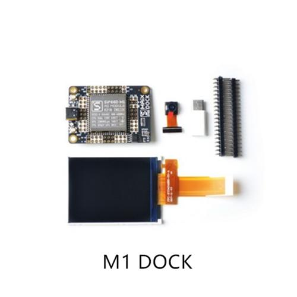

# discrption
> 这是一个相册项目，功能未开发完毕，尚在修改中
> 版本v1.0.0
> 实现功能：移植开源项目　https://github.com/nothings/stb　stbi_image.h &stbi_image_resize.h
> 具体实现将stbi_image.h中的图片读取流从标准的fread,fopen,fclose,更改为ff.h中的f_read,f_open,f_close();
> 并实现了rgb888->rgb565的图片流转换
> 版本v1.1.0
> 实现功能：移植开源项目　https://github.com/richgel999/picojpeg
> 具体工作为将picojpeg.c　picojpeg.h添加到项目中，增加接口封装stb_jpg_load.c实现读取sd卡内图片jpeg功能

### 1.硬件
硬件系统为k210开发板Sipeed_MAIX_DOCK，摄像头为gc0328,lcd 分辨率为320*240:


### 2.软件
软件是基于基于LicheeDan_K210_examples修改而成。
* 关于LicheeDan_K210_examples可以查询github仓库：
         https://github.com/Lichee-Pi/LicheeDan_K210_examples
* 基于基于LicheeDan_K210_examples/dvp_ov项目修改而成，其中gc0382驱动代码来自项目MAXPY
        https://github.com/sipeed/MaixPy
### 3.软件编译
* 安装编译工具 https://kendryte.com/downloads/
* 解压编译工具到　/opt
* 确保　ls /opt/kendryte-toolchain/bin 下存在下面的工具
* make                           riscv64-unknown-elf-g++         riscv64-unknown-elf-gcov-tool      riscv64-unknown-elf-objdump
riscv64-unknown-elf-addr2line ...
* 编译方法:
```shell
mkdir build && cd build
cmake .. -DPROJ=album -DTOOLCHAIN=/opt/kendryte-toolchain/bin 
make
```
* 烧录方法：
* 安装kflash
```shell
pip3 install kflash
kflash --help
```
* 烧录
```shell
kflash -p /dev/ttyUSB0 -b 1500000 album.bin
```
###　4.展示效果
烧录程序之后，会轮流播放sd 卡根目录下的图片img1-6.jpg


